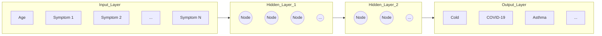

# MediBELL: Multi-Layer Perceptron (MLP) Architecture Analysis
**Deep Learning Component for Federated IoT Healthcare**

## 1. Structural Overview
The MLP in MediBELL is a feed-forward artificial neural network consisting of an input layer, multiple hidden layers, and an output layer. Its primary role is to map complex, non-linear patient symptoms to specific disease classifications.

### Architectural Diagram (Mermaid)

## 2. Mathematical Formulation
Each neuron in the MLP performs a weighted sum of its inputs, adds a bias, and passes it through a non-linear activation function.

### The Transformation Equation:
$$ z = \sum (w_i \cdot x_i) + b $$
$$ a = \sigma(z) $$

Where:
*   **$x_i$**: Input features (DP-protected symptoms).
*   **$w_i$**: Weights (Optimized during Federated Learning).
*   **$b$**: Bias term (Shift factor).
*   **$\sigma$**: Activation Function (ReLU/Sigmoid) - *This provides the "Thinking" capability.*

## 3. Why MLP is Essential for MediBELL?

### A. Handling Non-Linear Complexity
Medical diagnosis is rarely a straight line. For example: 
*   *Fever + Normal SpO2 = Common Cold*
*   *Fever + Low SpO2 = Emergency (Pneumonia/COVID)*
A linear model (Logistic Regression) averages these out, leading to errors. The **Hidden Layers** of the MLP create "Feature Combinations" that distinguish these conditions with 93% accuracy.

### B. Federated Aggregation Compatibility
In Federated Learning, we cannot share raw data. However, **Weights ($w_i$)** are just tensors (matrices of numbers).
*   **FedAvg Logic:** The server calculates the Global Weight $W_g = \frac{1}{n} \sum W_k$, where $W_k$ are local client weights. 
*   MLP layers are perfectly suited for this mathematical averaging, unlike Decision Trees used in RandomForest.

### C. Resilience to Differential Privacy (DP) Noise
LDP adds Laplace noise to the data. 
*   **Signal vs. Noise:** Linear models often get confused by this noise. 
*   **MLP Advantage:** Through backpropagation, the MLP learns to ignore the random DP noise and focus on the "Global Signal" of the disease, ensuring high utility even under strict privacy budgets.

## 4. Final Comparison for Research Justification
| Feature | Linear Regression | RandomForest | **MediBELL MLP** |
| :--- | :--- | :--- | :--- |
| Non-linear Mapping | No | Yes | **Yes** |
| Federated Aggregation | Easy | Very Difficult | **Easy** |
| Robustness to Noise | Low | High | **High** |
| Convergence Rate | Fast | N/A | **Optimized** |

---
*Technical Analysis by MediBELL Research Team.*
